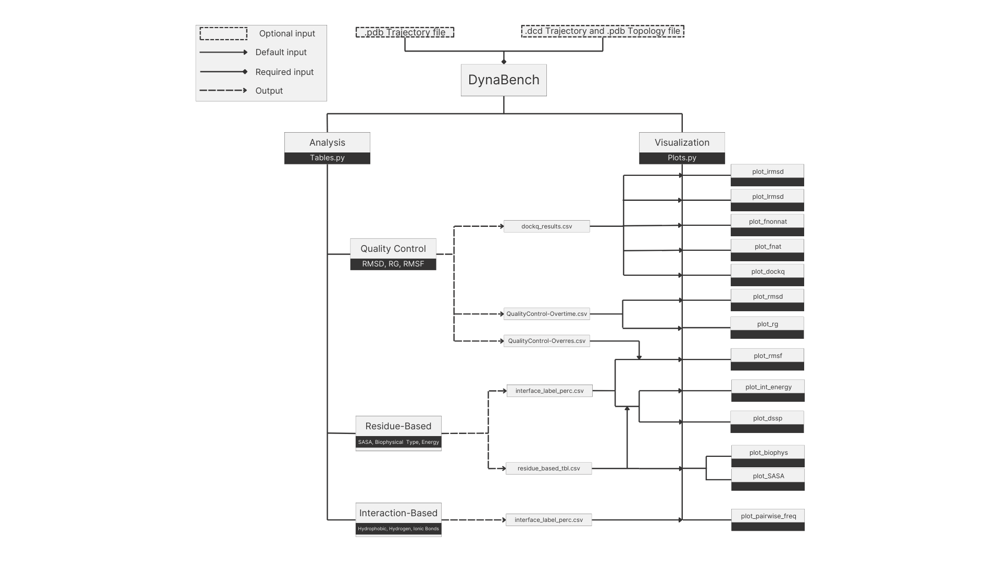
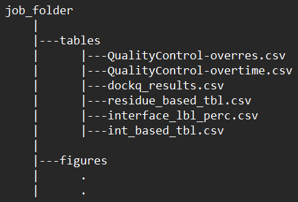

# DynaBench
The Dynabench package is an analysis pipeline for molecular dynamic simulations. The package runs analysis in three parts:
* **Quality Control:** RMSD, RG, RMSF, Fnat, Fnonnat, iRMSD, lRMSD, and DockQ Score analysis.
* **Residue Based:** Biophysical and core-rim classifications; SASA, residue energy, Interface Area and DSSP analysis.
* **Interaction Based:** Hydrogen, Hydrophobic, and Ionic Bond analysis with corresponding pairwise residues.

For detailed documentation, please visit https://dynabench.gitbook.io/dynabench

### DynaBench Architecture
DynaBench calls several python packages and custom scripts to run Quality Control, Residue Based, and Interaction Based analysis. According to the results of the analysis, by merging some results, visualizations are made. 





### DynaBench Output Files
DynaBench output files are stored in two folders: *tables* and *figures*. Analysis results are stored in the *tables* folder in .csv form while visualization are stored in the *figures* folder. Also, three additional folders; dssp_results, foldx_outputs, models may be generated as a result of DSSP, FoldX and splitting trajectory into frames, respectively. 




* **QualityControl-overtime.csv:** Includes RMSD and RG analysis results for each chain and complex.
* **QualityControl-overres.csv:** Includes RMSF analysis results for each chain.
* **dockq_results.csv:** Includes iRMSD, DockQ Score, lRMSD Fraction of Non-Native Contacts and Fraction of native contacts analysis results for each chain mapping.
* **residue_based_tbl.csv:** Includes residue based biophysical and core-rim classification, SASA analysis, intermolecular and intramolecular energy analysis results for given frames.
* **interface_label_perc.csv:** Includes the class in which the residues are found most frequently throughout the simulation and what percentage of the given frames they are in that class.
* **int_based_table.csv:** Includes the Hydrogen, Hydrophobic, and Ionics bond with interacting pairwise atoms and residues for given frames.

## Usage
### System Dependencies
* python3 (3.8 or higher)
* anaconda3
### Python Dependencies
* ipywidgets
* ipykernel
* pdbfixer
* seaborn
* mdanalysis
* jsonpickle
* moviepy
* matplotlib
* pdb-tools
* freesasa
* nglview

### Installation

**We recommend you use [git](https://git-scm.com/downloads) clone instead of download with .zip while installing the package. Downloading with .zip may cause problems in test pdbs. Because test folders contain large files, there may be errors during cloning the repository. To avoid these possible error you can install GIT-LFS. To install git-lfs, please visit https://git-lfs.com/**

### Clone the repository
```
git clone https://github.com/Atakanzsn/DynaBench.git
```
```
cd DynaBench
```
### Create DynaBench environment
```
conda env create -f requirements.yml
```
```
conda activate DynaBench
```
### Create IpyKernel for DynaBench
```
python -m ipykernel install --user --name dynabench
```
### Build the DynaBench
```
python setup.py build
python setup.py install
```
### Build FoldX for Energy Analysis
DynaBench uses FoldX for energy analysis. You should download [FoldX](https://foldxsuite.crg.eu/) by yourself. While running Residue-Based analysis, you should give FoldX executable path to the function.

### DSSP for Secondary Structure Analysis
DynaBench runs the DSSP module according to the user's operating system and calculates the secondary structures of the residues for each frame. To run the DSSP, the user must use Linux/OsX or Windows Subsystem for Linux (WSL). 

- To install the WSL, please visit https://learn.microsoft.com/en-us/windows/wsl/install. 
- To install the DSSP, please type  ```sudo apt-get install dssp``` in your bash. Id you are using WSL, type ```wsl sudo apt-get install dssp```.
## Tests
Please run the jupyter notebooks in the **tests** folder to test the package. They will create folders with *tests* at the end. Check outputs with the folder without the *tests* at the end. Outputs should be identical.

## Run
You can run from a script or shell. To run from the terminal, you can either run with JSON file or you can choose options from the shell. If running from the terminal, please do not run inside the DynaBench folder. It may cause import errors.
#### Example Script
```
import DynaBench

#load trajectory .dcd and topology .pdb file
mol = DynaBench.dynabench(trajectory_file='your_trajectory_path', topology_file='your_topology_path',
 split_models=True, show_time_as='Frame')

#define plotter class
draw = DynaBench.Plotter(job_name=mol.job_name)

#Quality control analysis and visualization
mol.run_quality_control(rmsd_data={'ref_struc':None, 'ref_frame':0})

draw.plot_rmsd(path=None)
draw.plot_rg(path=None)
draw.plot_irmsd(path=None)
draw.plot_lrmsd(path=None)
draw.plot_dockq(path=None)
draw.plot_fnonnat(path=None)
draw.plot_fnat(path=None)

#RMSF plot can be plotted after residue-based analysis due to marking of interface residues on the plot.

#Residue Based analysis and visualization

mol.run_res_based('foldx_executable_path', run_dssp=True)


draw.plot_rmsf(rmsf_path=None, intf_path=None)
draw.plot_int_energy(thereshold=50.0, res_path=None, intf_path=None)
draw.plot_biophys(path=None)
draw.plot_SASA()
draw.plot_DSSP(path=None, thereshold=50.0, intf_path=None)

#Interaction Based analysis and visualization

mol.run_inter_based()

draw.plot_pairwise_freq(path=None)


#Get .json files for analysis and plots.
mol._get_params_()
draw._get_params_()
```

### Run from terminal

Complete run (Quality control, Residue-Based, and Interaction-Based analysis with all visualizations) with input file from the terminal:
#### With .pdb trajectory
```
dynabench --job_name=job_name --trajectory_file=trajectory_file.pdb --commands=all_analysis,all_plots --foldx_path=foldx_path
```
#### With .dcd trajectory, and .pdb topology, stride value 20
```
dynabench --job_name=job_name --trajectory_file=trajectory_file.dcd --commands=all_analysis,all_plots --topology_file=topology_file.pdb --foldx_path=foldx_path --stride=20
```

#### To run with JSON file from the terminal:
```
dynabench --table_json=table_params.json --plot_json=plot_params.json
```

#### For more options to run from terminal: 
```
dynabench -h
```
